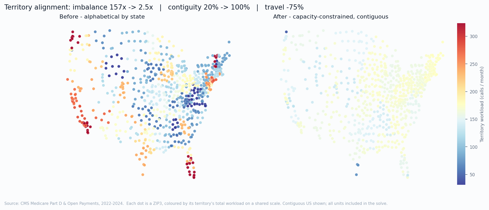
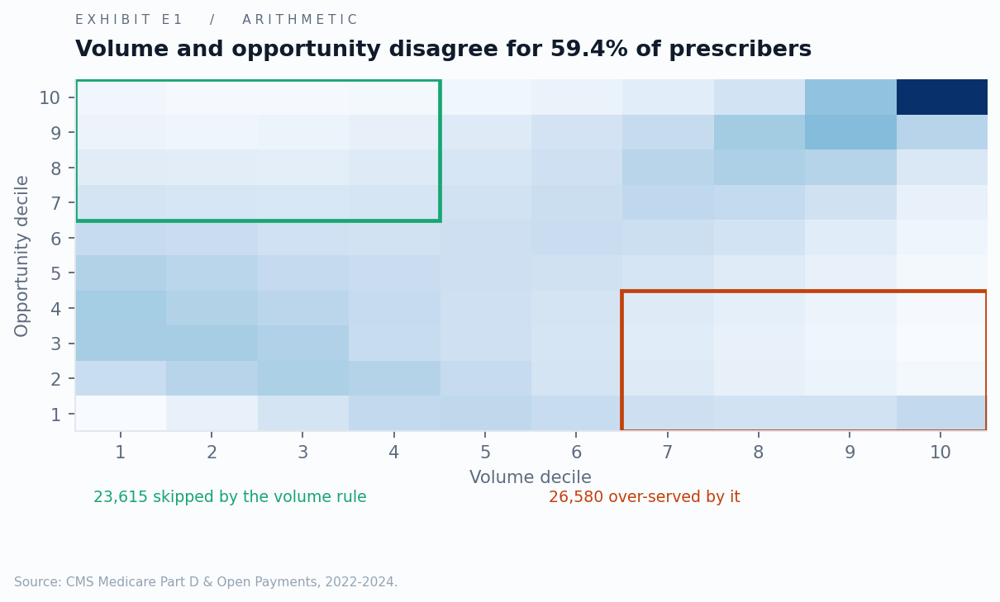
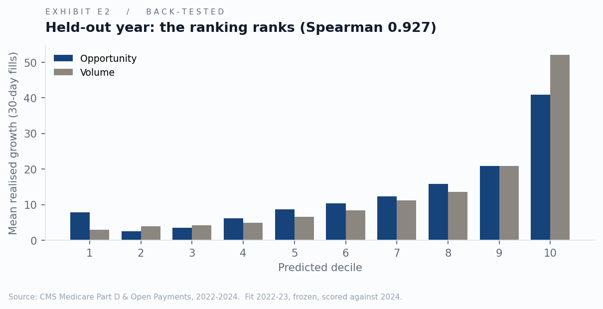
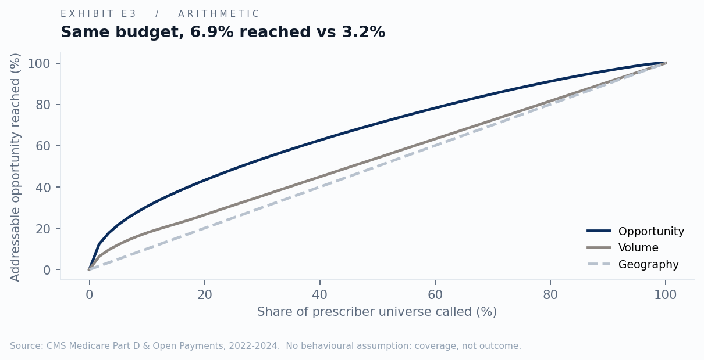
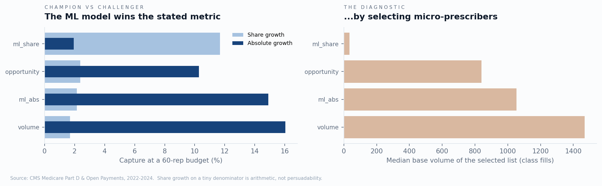

# PharmaTarget

**Prescribers this model flagged as high-opportunity in 2023 grew branded volume
1.50× faster in 2024 — a year the model never saw — than volume-matched
prescribers it did not flag.**

An HCP targeting and territory alignment engine for a branded direct oral
anticoagulant, built on 29 GB of real Medicare Part D and Open Payments data
covering **1.38 million prescribers across 2022–2024**. Four questions end to
end: who to call on, how often, how many reps, and how to draw the map.



*Each dot is a ZIP3, coloured by its territory's total monthly workload on a
shared scale. Left: territories drawn alphabetically by state. Right:
capacity-constrained and contiguity-repaired. Same 60 reps.*

| Territory alignment, 60 reps | Before | After |
|---|---|---|
| Workload imbalance (max ÷ min) | 157.2× | **2.5×** |
| Contiguous territories | 20% | **100%** |
| Mean travel per call | 258 mi | **65 mi** |
| Workload CV (at 80 reps) | 0.42 | **0.102** |

---

## The business problem

Northwind Pharma markets a branded DOAC with a fixed field force of 60 reps,
roughly $15M/year fully loaded. The force is targeted the way the industry
targets by default — rank prescribers by prescription volume, call the top
deciles.

That rule is structurally wrong. A cardiologist writing 400 class fills a year
at 91% brand share has almost nothing left to win. An internist writing 120 at
6% share, in a county with high stroke prevalence and an elderly panel, has a
great deal. Volume ranking cannot tell them apart, because volume is the wrong
quantity. The right one is **opportunity** — what a prescriber could reasonably
reach, minus what they currently give us.

## Key findings

Each finding is tagged by what kind of claim it is. Nothing here blurs the line
between something computed, something validated, and something projected.

**1. The model works out-of-time** · *back-tested*
Fit on 2022–23, frozen, scored against 2024. Spearman 0.927 between predicted
decile and realised growth. Flagged prescribers grew **1.50×** faster than
volume-matched controls. Share-growth capture **1.39×** the volume rule.

**2. Volume and opportunity disagree for 59.4% of in-market prescribers** · *arithmetic*
23,615 are low-volume/high-opportunity — invisible to the volume rule. 26,580
are high-volume/low-opportunity — over-served by it.

**3. At a fixed 60-rep budget, opportunity targeting reaches 6.9% of addressable
opportunity against 3.2% for volume and 0.6% for geography** · *arithmetic*
Same headcount, same call budget. 2.2× more opportunity in front of a rep.

**4. The force is drastically under-sized** · *arithmetic, then scenario*
60 reps can serve **8,389 of 267,171 in-market prescribers — 3.1%**, at 100%
capacity utilisation. The unconstrained call plan wants 106,869 prescribers,
implying **579 reps**. Marginal-rep economics put break-even at **586 reps**
(sensitivity 471–700). The first half of that is arithmetic; the break-even
figure is a scenario resting on a fitted response curve.

**5. Suppression hides 13.7% of all claim volume, and it is not random** · *arithmetic*
99.7% of prescriber-years are affected. The bias is systematic:

| Prescriber size | Share of their volume hidden |
|---|---|
| <100 claims | **68.7%** |
| 100–500 | 43.0% |
| 500–2,000 | 21.6% |
| 2,000+ | 8.6% |

Small prescribers are close to invisible in this data.

**6. Promotional payments: the selection gap is the finding**
Naive OLS puts the elasticity at **0.061**. On the matched cohort it collapses to
**0.002** — a factor of **29**. Nearly the entire apparent effect of promotional
spend is selection: manufacturers pay prescribers who were already going to
write. Quoting the naive figure alone would overstate the return on promotion by
an order of magnitude.

The parallel-trends test **failed** — treated and control prescribers were
already diverging before any payment arrived — so the estimate is reported as an
**association only** and all causal language was removed, per the pre-committed
protocol in [CHARTER.md](CHARTER.md). That decision was written down before the
model was fit.

**7. Behavioural segmentation is stable** · *arithmetic*
k=8, silhouette 0.807, bootstrap adjusted Rand index **0.998** across 25
resamples. Segments chosen on stability as well as separation — a k that
reshuffles under resampling is not a segmentation, it is one partition of one
sample.

---

## The uncomfortable result, reported in full

The obvious machine-learning alternative was never tested, so I tested it: train
a model to predict next-year growth **directly**, with more features than the
frontier model is allowed, strictly out-of-time. At the real 60-rep budget:

| Targeting rule | Share capture | Absolute capture | Median base of selected list |
|---|---|---|---|
| ML, trained on share growth | **11.7%** | 1.9% | **35 fills** |
| Frontier opportunity *(this project)* | 2.4% | 10.3% | 840 fills |
| ML, trained on absolute growth | 2.1% | 14.9% | 1,052 fills |
| Volume ranking | 1.7% | **16.0%** | 1,470 fills |

**The ML challenger beat this project's model 4.9× on the stated criterion — and
the win is worthless.** It selects prescribers writing a median of 35 class
fills a year, where share swings on a single prescription, and delivers 1.9% of
actual volume. 8,400 rep visits to 35-fill prescribers produce nothing.

Two things follow, and both are in the code:

- **The share-capture criterion was gameable**, so gate G3 no longer rests on it.
  It now requires the ranking to order correctly, to beat volume on the
  volume-neutral outcome, **and** for the selected list's median base volume to
  stay within 25% of the volume rule's. This model passes at 61%.
- **On absolute growth, plain volume ranking wins (16.0%).** I cannot tell you
  whether that means volume targeting is better, because the back-test measures
  where growth *happened* and large prescribers grow in absolute terms whether
  or not anyone visits them. Separating the two needs rep call data, which CMS
  does not contain.

Reporting four rules and the diagnosis is the honest state of the evidence. A
single declared winner would not be.

---

## The exhibits

| | |
|---|---|
|  |  |
| **E1** — volume and opportunity rankings disagree | **E2** — the held-out year: the ranking ranks |
|  |  |
| **E3** — same budget, more opportunity reached | **E6** — the ML challenger wins the metric by gaming it |

Full deck: **[PharmaTarget_Recommendations.pdf](outputs/PharmaTarget_Recommendations.pdf)** (13 slides).

Every figure and every slide is generated from the pipeline output by
`python -m src.report.make_assets` — nothing is typed in, so the deck cannot
drift from the analysis.

## Run it

```bash
pip install -r requirements.txt && python -m src.pipeline --synthetic --sample && python -m uvicorn api.main:app
```

Two minutes, no downloads, no API keys — then open <http://localhost:8000>.

For real CMS data, put the source files in `dataset/` and run the resumable
pipeline:

```bash
.\run_all.ps1
```

Each stage is skipped when its artifact is newer than the module that produces
it, so an interrupted run resumes and an edited module re-runs only what it
affects. Read the findings at any point with `python -m src.utils.summary`.

The public deployment at [https://pharmatarget.onrender.com](https://pharmatarget.onrender.com) serves the top 50,000 prescribers by opportunity out of 1,380,665 analysed; the `data_scope` object in [`/api/meta`](https://pharmatarget.onrender.com/api/meta) states this explicitly, and the Targets page surfaces it as a disclosure line.

| Command | What it does |
|---|---|
| `make sample` | Synthetic data + full pipeline (~2 min) |
| `make download` | Fetch CMS sources (streamed and filtered, ~14 GB transferred) |
| `.\run_all.ps1 -Serve` | Full pipeline, then serve on :8000 |
| `make web-install && make web` | Frontend dev server on :5173 |
| `make test` | 41 tests |

### On the synthetic mode

The repo ships a generator emitting files with the exact CMS column names and
the same structural quirks, so the ETL cannot tell synthetic from real and
anyone can run the pipeline in two minutes instead of downloading 29 GB.

**It validates the pipeline, not the finding** — the generative process encodes
the hypothesis the model tests, so confirming it there is circular. Every
artifact is stamped `SYNTHETIC` in the manifest and the UI shows a
non-dismissible banner.

That mode also taught the lesson it exists to prevent. The generator originally
emitted a column called `Bene_Age_GE_65_Cnt`. No such column exists in CMS — the
real file publishes age *bands*. The entire pipeline ran green on synthetic data
and failed on the first real extract. **A generator that invents a schema
validates your pipeline against a world that isn't there.**

---

## Method

```
dataset/ (29 GB)  ──►  streamed + filtered  ──►  DuckDB marts  ──►  sklearn  ──►  FastAPI  ──►  React
                        ~200 MB retained         4.13M rows       parquet        12 routes
```

**Ingest streams rather than downloads.** Naively pulling every source is ~40 GB.
Each file is consumed as a stream and reduced on the fly: keep class rows, and
accumulate a per-NPI running total across *all* drugs on the way past. That
running total is the whole trick — the suppression reconciliation needs Σ(all
drug rows) per prescriber, and filtering to the class first would destroy it.
80.0M drug rows in, 1.52M class rows out.

**Suppression, handled correctly.** CMS does not blank low-volume cells in the
Provider-and-Drug file — it **removes the row**. Any NPI × drug pair under 11
claims is absent entirely, so you cannot flag a censored row. The gap is
recovered by reconciling provider-level totals (not row-suppressed) against the
sum of drug rows, then imputed under a truncated distribution, with three
imputation modes running end to end.

**Potential and opportunity.** A histogram gradient-boosted **quantile**
regression at τ=0.80 predicts log class volume from practice and market
covariates only — panel size net of the class, patient risk score, ZIP3 stroke
and coronary prevalence from CDC PLACES, population density. The 80th percentile
is the achievable frontier: what a *strong* comparable prescriber reaches, not an
average one. Then `opportunity = potential_class × achievable_share − brand_fills`.

- In-sample coverage **0.785** against τ=0.80 — the quantile fit converged, so
  the frontier reading is earned rather than asserted. (The primary fit on the
  full 2023 universe reaches 0.800; the value in the manifest is the back-test's
  frozen refit on the training subset, which is the more conservative figure and
  therefore the one quoted.)
- Cross-checked against a corrected-OLS stochastic-frontier approximation:
  Spearman **0.849**. SFA is the textbook approach; agreement that close means
  the choice of quantile GBM is a convenience, not a load-bearing assumption.
- Top driver is practice size at **32.4%** of permutation importance — the market
  covariates carry real weight, so the model is not merely predicting panel size.
- **The leakage guard raises, never warns.** Name check plus a correlation check
  at r > 0.97, on every fit.

**Deciling happens within the addressable market.** 1.38M prescribers appear in
Part D; 267,171 write anticoagulants. Deciling across all of them would make
"decile 9" mean "writes the class at all" rather than "is worth a visit".

**The call plan is capacity-constrained.** The matrix is a frequency policy, not
a plan. Applied to everyone it produced a target list implying 4,575 reps against
a force of 60. Real planning ranks the universe and fills the diaries from the
top; the population past that cut is a finding, and it is what the sizing module
then prices.

**Territories use capacitated k-means with contiguity repair and a balance
pass.** Plain capacitated k-means leaves a rep in Ohio owning ZIP3s in Indiana —
tidy at national zoom, unimplementable in the field. Contiguity is repaired
inside the iteration loop and asserted in tests. Geography comes from the Census
Gazetteer crossed with CDC PLACES: 896 ZIP3 units, population-weighted centroids.

---

## Limitations

1. **Medicare-only.** Part D excludes commercial and Medicaid patients and skews
   65+. Less distorting for a DOAC than most classes — the indicated population
   is largely elderly — but it still under-counts younger AF patients.
2. **~17-month data lag.** Data year 2024 was published May 2026. Better than the
   two years usually quoted, but not current market conditions.
3. **Suppression bias remains.** The reconciliation sizes the hidden mass but
   cannot recover which drugs it belonged to. Residual bias understates
   low-volume prescribers, who are 68.7% hidden.
4. **Payments are not causal.** The parallel-trends test failed on this data.
   Matching balances observed covariates only.
5. **No call-activity data.** Current-state allocation is inferred from
   geography, not observed. Finding 3 compares two allocation *rules*, not this
   model against Northwind's actual field behaviour.
6. **The back-test measures where growth happened, not where a call would have
   caused it.** No CMS-only design can separate the two. This is why absolute
   capture is reported but not used as a pass condition.
7. **Straight-line distance, not drive time.** Coastal and mountain territories
   are where this hurts.
8. **PLACES carries no atrial fibrillation measure** — the actual DOAC
   indication. Stroke, coronary heart disease and hypertension prevalence are
   used as proxies, and are labelled as proxies everywhere they appear.
9. **Territory granularity.** ZIP3 units are indivisible. Real alignments split
   to ZIP5 to go finer.
10. **The territory model ignores** rep tenure, existing relationships and org
    boundaries, which dominate real alignment decisions.
11. **Economics are public benchmarks, not the client's actuals.** All six live in
    `config/economics.yaml` with ranges and a stated basis; the tornado chart
    shows which ones the recommendation is actually sensitive to.

---

## Repo

```
config/      params.yaml, economics.yaml, manufacturers.yaml — every tunable
src/ingest/  streaming download, geography build, synthetic generator
src/sql/     01 staging → 03 suppression reconciliation → 05 marts
src/models/  opportunity · callplan · backtest · challenger · sizing
             territory · segmentation · response
api/         12 routes, one read-only DuckDB connection, all filtering in SQL
web/         React 18 + TS + Vite, 104 KB gzipped, five routes
tests/       41 tests — leakage guards, contiguity floors, suppression identities
run_all.ps1  resumable, dependency-aware pipeline runner
```

`/api/hcps` p95 is **71 ms** across 1.38M rows. Filtering, sorting and pagination
happen in SQL — never in Python lists, never in the browser.

**A note on manufacturer names.** Open Payments legal names bear no resemblance
to how anyone writes them, and drift between years: `Bristol Myers Squibb
Company` (no hyphen), `PFIZER INC.` (upper case), `Janssen Pharmaceuticals, Inc`
(no period). Worse, the headline BMS entity carries only ~124 payment records —
the apixaban alliance reports through `E.R. Squibb & Sons, L.L.C.`, with 236,558.
An exact-match filter on a guessed name returns zero rows and no error, so names
are **discovered** per year (`--discover-manufacturers`) rather than assumed, and
any configured name matching zero rows is logged.

**Data sources:** [Part D Prescribers by Provider and Drug](https://data.cms.gov/provider-summary-by-type-of-service) ·
[Part D by Provider](https://data.cms.gov/provider-summary-by-type-of-service) ·
[Open Payments](https://openpaymentsdata.cms.gov/) ·
[Census Gazetteer ZCTA](https://www.census.gov/geographies/reference-files.html) ·
[CDC PLACES](https://data.cdc.gov/)

`data/` and `dataset/` are gitignored. See [CHARTER.md](CHARTER.md) for the
pre-committed protocol — including what was to happen if the back-test failed,
decided before it was run.
